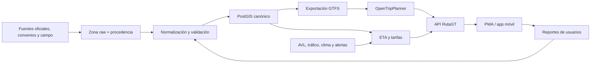

# RutaGT — plan de producto, datos y módulos

Actualizado: 15 de agosto de 2026  
Zona horaria operativa: `America/Guatemala`

## 1. Nombre recomendado

**RutaGT**  
Descriptor: **Rutas de transporte público de Guatemala**  
Promesa corta: **Tu bus, tu ruta, a tiempo.**

Es un nombre de trabajo claro, corto y extensible fuera de la capital. Antes de invertir en marca se debe verificar el Registro de la Propiedad Intelectual, dominios y nombres en App Store/Google Play. Una búsqueda web preliminar no sustituye ese proceso.

## 2. Decisión de alcance

La aplicación no debe comenzar intentando cubrir “todos los buses de Guatemala”. El producto inicial debe cubrir el **Área Metropolitana de Guatemala**, pero la primera base verificable será:

1. Transmetro.
2. TuBus.
3. Un corredor piloto que obligue a integrar otros operadores: **Metrocentro/Villa Nueva ↔ Universidad del Valle de Guatemala**.

Ese corredor requiere, según el recorrido finalmente validado, datos de Villa Nueva/TransMIO, rutas urbanas o extraurbanas, Transurbano, Transmetro, TuBus y posiblemente rutas de Santa Catarina Pinula. Es una buena prueba porque revela desde el inicio los problemas de transbordo, distintas formas de pago y falta de horarios.

La meta del MVP no es prometer precisión falsa. Cada resultado debe mostrar:

- hora recomendada para salir;
- caminata inicial y final;
- bus identificable por sistema, número, rótulo, color y destino mostrado;
- parada exacta y lado de la vía;
- transbordos y tiempo mínimo para realizarlos;
- intervalo de espera, no una hora ficticiamente exacta;
- tiempo esperado y rango de incertidumbre;
- costo y medio de pago;
- fecha/fuente de la última verificación;
- alternativa de respaldo.

## 3. Lo que ya se pudo verificar

Las capas públicas vivas de la Municipalidad de Guatemala contienen actualmente:

| Conjunto                   | Registros comprobados | Contenido útil                                            | Lo que falta                                             |
| -------------------------- | --------------------: | --------------------------------------------------------- | -------------------------------------------------------- |
| Estaciones Transmetro 2025 |                   169 | punto, nombre, dirección, zona, código de ruta            | secuencia, sentido, horario y correspondencias completas |
| Paradas TuBus 2025         |                   278 | punto, nombre, dirección, zona, código de ruta            | secuencia, sentido, horario y accesibilidad consistente  |
| Rutas Transmetro 2025      |                    12 | geometría y código de línea/variante                      | calendarios, frecuencia y reglas de operación            |
| Rutas TuBus 2025           |                     8 | geometría y código: 5, 104, 105, 305, 402, 404, 801 y 802 | nombre de ruta en la capa, frecuencia y viajes           |

Ítems oficiales actuales de ArcGIS:

- [Estaciones Transmetro 2025](https://www.arcgis.com/home/item.html?id=33ccb2f3a7ca4e9f9684a6e820ac3264)
- [Paradas TuBus 2025](https://www.arcgis.com/home/item.html?id=4ad911fd926b4320b92c67a26385bd94)
- [Rutas Transmetro 2025](https://www.arcgis.com/home/item.html?id=863fb3efa0d74f688755a3f21de035a2)
- [Rutas TuBus 2025](https://www.arcgis.com/home/item.html?id=a355c245f38f4ccd89a3291fc0162f74)

Hallazgos de calidad:

- Los identificadores del inventario municipal de 2025 dejaron de ser los identificadores vivos; por eso el recolector busca por propietario/título y usa el ítem más reciente.
- La exportación verificada el 15 de agosto de 2026 no presentó caracteres Unicode de reemplazo, pero el recolector conserva la validación porque la codificación puede variar entre publicaciones. Cualquier corrección futura debe vivir en otra capa, con evidencia.
- Las paradas tienen `Codigoruta`, pero no una secuencia inequívoca por sentido. Ordenarlas solamente por proximidad a la línea falla en circuitos, retornos y rutas que comparten vía.
- La geometría sirve para dibujar el mapa; todavía no basta para planear viajes con hora de llegada.
- Los metadatos permiten reutilizar con atribución, pero remiten genéricamente a Creative Commons sin indicar una variante concreta. Hay que pedir confirmación escrita de la licencia.

La [página oficial de Movilidad Urbana](https://www.muniguate.com/movilidadurbana/transmetro/) y los ruteros PDF de TuBus complementan las capas con mapas y ventanas de servicio. Por ejemplo, el [rutero oficial de la ruta 801](https://www.muniguate.com/movilidadurbana/wp-content/uploads/sites/33/2025/06/V4-Mapa-y-Rutero-individual-Ruta-801-c.pdf) incluye direcciones de paradas y conexiones peatonales.

## 4. Información exacta que debe almacenar la base

GTFS Schedule será el contrato de intercambio. La base interna PostGIS puede ser más rica, pero debe poder importar y exportar GTFS. La especificación básica utiliza `agency`, `routes`, `trips`, `stops`, `stop_times`, `calendar` y `calendar_dates`; las frecuencias, tarifas, transbordos y formas son extensiones del mismo estándar.

### 4.1 Procedencia y gobierno de datos — obligatorio para cada registro

| Campo                           | Propósito                                                                      |
| ------------------------------- | ------------------------------------------------------------------------------ |
| `source_id`, institución y URL  | saber quién afirmó el dato                                                     |
| tipo de fuente                  | oficial abierta, solicitud oficial, convenio, API comercial, campo o comunidad |
| `fetched_at`                    | saber cuándo se descargó                                                       |
| `valid_from` / `valid_to`       | separar publicación de vigencia operativa                                      |
| identificador externo           | reencontrar el registro en su fuente                                           |
| `raw_payload`                   | conservar la evidencia sin modificar                                           |
| checksum SHA-256                | detectar cambios y reproducir una versión                                      |
| licencia y atribución           | permitir el uso legal y mostrar créditos                                       |
| calidad/confianza               | oficial, verificado, probable o no verificado                                  |
| revisor y fecha de verificación | auditoría humana                                                               |

Nunca se debe sobreescribir el original para “corregirlo”. Se conserva una zona **raw**, otra **normalizada** y versiones **publicadas**.

### 4.2 Operadores y sistemas

- ID estable de agencia.
- Nombre legal, nombre público y sistema/marca.
- Entidad reguladora y jurisdicción.
- Teléfono, correo, web y redes oficiales.
- Logotipo y reglas de atribución.
- Zona horaria e idioma.
- Estado: planeado, activo, suspendido o retirado.
- Formas de pago aceptadas y puntos de adquisición/recarga.

### 4.3 Rutas y variantes

- ID interno y código oficial visible al pasajero.
- Nombre corto, nombre largo, origen y destino.
- Sistema, operador y regulador.
- Tipo de vehículo/servicio: urbano, BRT, alimentador, expreso, extraurbano, etc.
- Color de línea en mapas, color del texto y **color/rótulo físico del bus**.
- Estado y fechas de vigencia.
- Variante o patrón: ida, vuelta, expreso, corto, desvío, hora pico.
- `direction_id`, destino frontal (`headsign`) y terminales.
- Forma geográfica por variante y distancia.
- Restricciones: solo ascenso, solo descenso, servicio especial, bicicletas, silla de ruedas.

Una ruta no equivale a un recorrido. La misma ruta puede tener múltiples patrones y cada patrón puede cambiar su lista de paradas.

### 4.4 Paradas, estaciones y terminales

- ID estable y código o número visible.
- Nombre oficial, nombre común y pronunciación si difieren.
- Latitud/longitud WGS84 con precisión conocida.
- Dirección, zona, municipio y punto de referencia.
- Lado de la calle, sentido servido y bahía/plataforma.
- Relación parada-plataforma-estación-terminal (`parent_station`).
- Rutas que la sirven y secuencia en cada patrón.
- Ascenso/descenso permitido.
- Accesibilidad, rampa, elevación, refugio, iluminación y seguridad.
- Foto actual y fecha de verificación, cuando haya permiso.
- Estado temporal: activa, trasladada, clausurada o informal.
- Radio geográfico razonable para detectar llegada del bus.

### 4.5 Secuencia, servicio y horario

- Patrón, parada y `stop_sequence` por sentido.
- Calendario de lunes a domingo.
- Fecha inicial/final y excepciones por feriados, eventos o suspensión.
- Viajes con salida fija, si existen.
- Para servicio por frecuencia: inicio, fin y `headway_secs` por franja y día.
- Primer y último servicio desde cada terminal.
- Tiempo programado entre paradas y tiempo de permanencia.
- Flota programada por franja y capacidad.
- Reglas operativas para viajes nocturnos que pasan de las 24:00.

Cuando un operador diga “cada 10 minutos”, la app debe guardar también quién lo afirmó, para qué franja y con qué fecha de vigencia.

### 4.6 Tarifas y pagos

- Producto tarifario y monto en GTQ.
- Precio por ruta, distancia, zona, horario o categoría.
- Servicio regular frente a expreso.
- Medio: efectivo, Tarjeta Ciudadana, SIGA, tarjeta bancaria u otro.
- Tarifa infantil, adulto mayor, estudiante y persona con discapacidad.
- Gratuidades y límite diario de viajes.
- Ventana y costo de transbordo; integración o pago nuevo.
- Lugar de compra/recarga y saldo mínimo.
- Fecha de vigencia, IVA y acuerdo/resolución que la autoriza.
- Tarifa autorizada y tarifa observada, como valores separados.

### 4.7 Vehículos e identificación visual

- ID público del vehículo, placa cuando sea lícito y necesario, operador y ruta asignada.
- Número de unidad, rótulo frontal/lateral, colores y fotografía de referencia.
- Modelo, capacidad, accesibilidad y equipamiento.
- Identificador AVL/GPS, si existe convenio.
- Estado de operación y fechas de mantenimiento, sin exponer información sensible.

### 4.8 Tiempo real e históricos

- Posición, rumbo, velocidad y momento de observación.
- Ruta, viaje, siguiente parada, ocupación y estado.
- Llegadas/salidas observadas por parada.
- Retraso y permanencia real.
- Alertas: accidente, bloqueo, desvío, parada movida, servicio suspendido.
- Historial de velocidad por segmento vial, día y franja.
- Clima/lluvia y eventos masivos.
- Predicción de llegada con versión de modelo e intervalo P50/P90.

No se necesitan datos personales del piloto ni del pasajero para calcular la ruta.

### 4.9 Caminata, transbordos y lugares

- Red peatonal, cruces, pasarelas, entradas y restricciones.
- Distancia y tiempo de transferencia entre plataformas.
- Accesibilidad de cada transferencia.
- POI y alias: “Metrocentro”, “UVG”, mercados, hospitales y universidades.
- Dirección geocodificada y punto de acceso real del destino, no solo su centroide.
- Horario de puertas/entradas cuando afecte el acceso.

### 4.10 Reportes comunitarios

- Tipo de reporte, lugar, ruta/parada/vehículo, momento y expiración.
- Evidencia, votos de confirmación y moderación.
- Confianza calculada y vínculo con la fuente oficial si luego se confirma.
- Identificador del reportero anonimizado; no guardar ubicación histórica innecesaria.

## 5. Dónde conseguir la información y cómo

| Información                                                          | Fuente prioritaria                                                                                                                                                     | Forma de obtención                                                                                                  | Estado                                 |
| -------------------------------------------------------------------- | ---------------------------------------------------------------------------------------------------------------------------------------------------------------------- | ------------------------------------------------------------------------------------------------------------------- | -------------------------------------- |
| geometría y estaciones Transmetro                                    | Portal DIGM/ArcGIS de MuniGuate                                                                                                                                        | REST `FeatureServer` → GeoJSON; revisión diaria/semanal                                                             | pública y comprobada                   |
| geometría y paradas TuBus                                            | Portal DIGM/ArcGIS de MuniGuate                                                                                                                                        | REST `FeatureServer` → GeoJSON                                                                                      | pública y comprobada                   |
| mapas, direcciones, ventanas de servicio                             | Movilidad Urbana MuniGuate                                                                                                                                             | catálogo HTML y PDF oficial; extracción asistida y validación                                                       | pública, no estructurada               |
| secuencia, calendarios, frecuencias, flota y AVL de Transmetro/TuBus | EMT, STP y Centro de Control                                                                                                                                           | solicitud UDI + convenio técnico; pedir GTFS/CSV/GeoJSON y API documentada                                          | por solicitar                          |
| nuevas rutas urbanas 2026                                            | Acuerdos municipales y Guatecompras NOG 27655148                                                                                                                       | anexos, TDR, adjudicación, contrato y actualizaciones operativas                                                    | pública/documental                     |
| Transurbano y Rutas Express                                          | SIGA, operadores y STP                                                                                                                                                 | convenio comercial/técnico con SIGA; solicitud a STP de licencias, recorridos y frecuencias                         | sin feed abierto identificado          |
| recarga y medios SIGA                                                | [SIGA](https://siga.com.gt/)                                                                                                                                           | web oficial y contacto `sac@siga.com.gt`, 1509                                                                      | pública/parcial                        |
| rutas extraurbanas                                                   | [DGT](https://dgt.gob.gt/)                                                                                                                                             | datos abiertos + solicitud LAIP de licencias, itinerarios, horarios, terminales y tarifas                           | tarifas parciales; resto por solicitar |
| red vial nacional                                                    | Dirección General de Caminos                                                                                                                                           | capas/cartografía de red vial; verificar licencia y versión                                                         | pública/documental                     |
| TransMIO y rutas de Villa Nueva                                      | Municipalidad de Villa Nueva                                                                                                                                           | solicitud electrónica/correo de información pública; pedir las 29 urbanas y 8 extraurbanas del inventario municipal | por solicitar                          |
| Express Mixco y rutas locales                                        | Municipalidad de Mixco, DDUT y EMIXTRA                                                                                                                                 | solicitud de inventario de unidades, rutas y frecuencias que la propia DDUT administra                              | por solicitar                          |
| Transpinula                                                          | Dirección Municipal de Transporte de Santa Catarina Pinula                                                                                                             | solicitud de rutas, estaciones, horarios, tarifa, flota y AVL                                                       | por solicitar                          |
| otros municipios metropolitanos                                      | Amatitlán, Chinautla, Fraijanes, Guatemala, Mixco, Palencia, San José Pinula, San Miguel Petapa, San Pedro Ayampuc, Santa Catarina Pinula, Villa Canales y Villa Nueva | una solicitud por entidad para rutas intra-municipales; DGT para las intermunicipales                               | expansión                              |
| red peatonal y mapa base                                             | [OpenStreetMap](https://www.openstreetmap.org/copyright)                                                                                                               | extracto PBF propio; atribución y cumplimiento ODbL; no depender del Nominatim público en producción                | abierta con obligaciones               |
| cobertura comparativa                                                | [Moovit Ciudad de Guatemala](https://moovitapp.com/index/es-419/transporte_p%C3%BAblico-Ciudad_de_Guatemala-6097)                                                      | usar como control humano; para producto, contratar sus APIs, no copiar ni raspar su base                            | comercial                              |
| clima y lluvia                                                       | [INSIVUMEH](https://insivumeh.gob.gt/variables_clima/)                                                                                                                 | descargas de 30 días, CSV disponibles y solicitud de históricos validados                                           | pública/parcial                        |
| tráfico presente/predicho                                            | telemetría propia; Google Routes API; acuerdo público Waze for Cities                                                                                                  | API comercial para MVP; convenio con autoridad para Waze; construir históricos propios                              | externo                                |
| incidentes y cierres                                                 | CCIT/EMETRA y PMT municipales                                                                                                                                          | convenio/API o boletín estructurado; reportes comunitarios como complemento                                         | por negociar                           |

### Fuentes que no deben rasparse sin permiso

- Las interfaces o APIs privadas de la app TuBus, SIGA, Moovit, Google Maps o Waze.
- Redes sociales como base maestra de rutas.
- Mapas de terceros cuyos términos no permiten crear una base derivada.

Se pueden usar sus páginas públicas como pista o verificación manual; para ingestión continua se requiere API, licencia o convenio.

## 6. Solicitudes institucionales: el paquete de datos correcto

No pedir simplemente “las rutas de buses”. Pedir, para **cada ruta y variante vigente**:

1. Código y nombre oficial; operador y licencia.
2. Estado y fechas de vigencia.
3. Geometría de ida y retorno en GeoJSON, Shapefile o KML.
4. Paradas con ID, nombre, latitud, longitud, dirección y sentido.
5. Secuencia exacta de paradas por variante.
6. Calendario, primer/último viaje, salidas o intervalos por franja y día.
7. Tiempo programado entre paradas y tiempo de terminal.
8. Tarifa, regla, medio de pago, descuentos y transbordos.
9. Flota programada, capacidad, color/rótulo y accesibilidad.
10. Cambios, cierres, desvíos y suspensión.
11. Datos AVL históricos y actuales, con diccionario y frecuencia de actualización.
12. Licencia/permiso de reutilización, atribución, diccionario de datos y contacto técnico.

La [Unidad de Información de MuniGuate](https://udi.muniguate.com/solicitudes/solicitudelectronica/) recibe solicitudes electrónicas y señala un plazo ordinario de 10 días hábiles. El [Decreto 57-2008](https://www.congreso.gob.gt/detalle_pdf/decretos/13082) permite pedir información en poder de autoridades; conviene solicitar entrega digital y formatos editables. Para una relación técnica continua, la LAIP solo es el comienzo: se necesita un convenio de actualización.

## 7. Cómo decidir “la mejor ruta”

No existe una sola mejor ruta para todos. Se deben generar alternativas Pareto y ordenar según preferencias:

`costo_generalizado = viaje + espera×1.8 + caminata×1.5 + transbordo×penalización + riesgo_incertidumbre + costo_monetario_convertido`

Perfiles iniciales:

- **Más rápida**: minimiza llegada esperada.
- **Más segura/confiable**: penaliza incertidumbre y transbordos cortos.
- **Más barata**: minimiza tarifa, con límite razonable de tiempo.
- **Menos caminata**: útil para lluvia o movilidad reducida.
- **Accesible**: elimina trayectos incompatibles con silla de ruedas.

Para “llegar a las 07:45”, el motor calcula hacia atrás usando el percentil P90, no solo el promedio. Si la ruta tarda normalmente 55 minutos pero su P90 es 78, la recomendación debe incluir ese margen.

## 8. Módulos del proyecto

1. **Catálogo de fuentes**: responsables, URL, licencia, frecuencia y salud de cada fuente.
2. **Ingesta**: ArcGIS, archivos, GTFS, APIs y cargas manuales.
3. **Normalización/GTFS**: IDs estables, corrección separada, deduplicación y conversión.
4. **Calidad y procedencia**: reglas, diffs, revisiones, historial y publicación de versiones.
5. **Backoffice cartográfico**: dibujar/editar patrones, ordenar paradas y aprobar cambios.
6. **Geocodificación y POI**: búsqueda de lugares, alias y accesos.
7. **Motor peatonal/transbordos**: caminatas, pasarelas y accesibilidad.
8. **Motor de transporte**: OpenTripPlanner con GTFS + OpenStreetMap.
9. **Tiempo real**: posiciones, alertas, tráfico e incidentes.
10. **Predicción ETA**: baseline por franja, luego modelo con AVL, tráfico y lluvia.
11. **Tarifas**: productos, medios de pago, descuentos y costo del itinerario.
12. **API pública**: plan de viaje, paradas cercanas, llegadas, alertas y versiones.
13. **Web/PWA**: mapa, indicaciones paso a paso, viaje guardado y modo de bajo consumo.
14. **Aplicación móvil**: ubicación, alertas de bajada y uso sin conexión; después del PWA.
15. **Reportes comunitarios**: recepción, reputación, caducidad y moderación.
16. **Notificaciones**: salida recomendada, disrupciones y alternativa.
17. **Administración de operadores**: acceso para que una entidad mantenga sus datos.
18. **Observabilidad, privacidad y seguridad**: métricas, auditoría, secretos, retención y consentimiento.

## 9. Arquitectura recomendada

- **PostgreSQL + PostGIS**: base canónica y geoespacial.
- **Almacenamiento de objetos**: snapshots crudos, PDF, fotos autorizadas y GTFS versionados.
- **Python**: recolección, normalización, validación y modelos de ETA.
- **OpenTripPlanner**: planeación multimodal sobre GTFS + OpenStreetMap.
- **API propia**: FastAPI o equivalente, sin exponer directamente la base.
- **Redis**: caché y estado breve de llegadas/alertas cuando sea necesario.
- **PWA primero**: React/Next.js o similar; app nativa solo cuando GPS en segundo plano y notificaciones lo justifiquen.

No se recomienda microservicios en el MVP. Un monolito modular, un proceso de datos y OpenTripPlanner reducen operación y permiten aprender rápido.

## 10. Fases y criterio de salida

### Fase 0 — acceso y gobierno de datos (2–4 semanas)

- Enviar solicitudes a MuniGuate/EMT/STP, DGT, Villa Nueva, Mixco y Santa Catarina Pinula.
- Contactar SIGA y Moovit para condiciones técnicas/comerciales.
- Aprobar política de fuentes, licencias, privacidad y correcciones.
- Definir el corredor piloto y hacer inventario de campo.

**Salida:** al menos un responsable y un mecanismo de actualización para cada sistema del corredor.

### Fase 1 — prototipo estático Transmetro + TuBus (4–8 semanas)

- Descargar, versionar y normalizar las cuatro capas GIS.
- Crear secuencias y calendarios a partir de datos oficiales/PDF, con revisión humana.
- Exportar GTFS válido y levantar OpenTripPlanner.
- PWA con origen/destino, mapa, instrucciones, tarifa y fuente.

**Salida:** 95 % de paradas vigentes verificadas y 20 viajes de prueba sin error grave de dirección/sentido.

### Fase 2 — corredor Metrocentro ↔ UVG (6–10 semanas)

- Integrar sistemas necesarios de Villa Nueva, SIGA/Transurbano, Transmetro, TuBus/Transpinula.
- Levantar frecuencia observada durante días laborales y fin de semana.
- Modelar transbordos, pagos y caminatas reales.

**Salida:** comparación contra 100 viajes observados; ETA mediana con error absoluto menor de 8 minutos y P90 publicado honestamente.

### Fase 3 — área metropolitana

- Incorporar municipios y extraurbanos por corredores.
- Publicar feed GTFS propio con atribución y actualización.
- Abrir panel de operadores y programa de colaboradores.

### Fase 4 — tiempo real

- Convenios AVL/GTFS Realtime.
- Alertas, ocupación y ETA por viaje.
- Tráfico/clima como variables, no como sustitutos del GPS del bus.

## 11. Riesgos principales

| Riesgo                           | Mitigación                                                            |
| -------------------------------- | --------------------------------------------------------------------- |
| no hay horarios confiables       | modelar frecuencias e incertidumbre; observar viajes; mostrar rangos  |
| rutas cambian sin aviso          | responsable por fuente, diff automático, alertas y caducidad          |
| licencia imprecisa               | confirmación escrita antes de redistribuir una base derivada          |
| APIs privadas cambian o bloquean | convenios y APIs documentadas; no ingeniería inversa como dependencia |
| ubicación de parada incorrecta   | validación en campo y lado/sentido de la vía                          |
| “mejor” ruta insegura o irreal   | tiempo mínimo de transbordo, P90 y perfiles de usuario                |
| cobertura enorme                 | expansión por corredores y métricas de completitud                    |
| costos de tráfico/mapas          | telemetría propia, caché permitido y OSM para mapa/ruteo base         |
| reportes maliciosos              | expiración, reputación, evidencia y moderación                        |

## 12. Primera definición de éxito

RutaGT será útil cuando una persona pueda ver una instrucción del tipo:

> Camina 4 minutos a la parada X, lado norte. Toma la ruta 105, bus azul/blanco con rótulo Y. Pasa cada 12–18 minutos entre 06:00 y 09:00. Baja en Z, cruza por la pasarela y deja 7 minutos para el transbordo. Costo estimado Q**. Para llegar antes de 07:45, sal a las 06:18; 90 % de los viajes observados llegaron antes de 07:39–07:48. Datos de operación verificados el **.

La precisión, el origen del dato y la incertidumbre forman parte del producto, no son notas al pie.
